# NA Ritiro Ingombranti — Manuale utente

**Versione applicazione:** 1.0.0  
**Edizione manuale:** 1.0  
**Uso previsto:** gestione locale delle prenotazioni di ritiro rifiuti ingombranti  
**Archiviazione:** database SQLite locale, senza invio automatico a servizi cloud

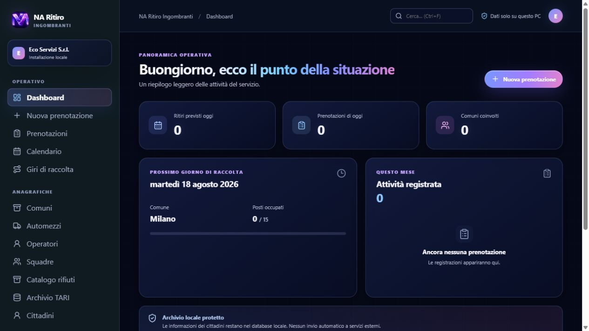

## 1. Scopo dell’applicazione

NA Ritiro Ingombranti aiuta gli operatori a:

- configurare azienda e Comuni serviti;
- registrare le richieste dei cittadini;
- controllare disponibilità e capacità giornaliera;
- pianificare i giri di raccolta;
- aggiornare l’esito operativo del ritiro;
- consultare lo storico per cittadino;
- importare e usare l’archivio TARI;
- produrre report ed esportazioni;
- creare backup locali del database;
- gestire utenti locali e tracciare le operazioni rilevanti.

L’app è pensata per funzionare offline. Nella versione desktop i dati vengono salvati nel database locale dell’installazione. L’URL `http://127.0.0.1:4173/` è una preview browser: è utile per vedere e provare l’interfaccia, ma il backup reale del file SQLite va eseguito dall’app desktop installata.

## 2. Avvio e configurazione iniziale

### 2.1 Primo avvio

Al primo avvio compare la procedura **Prepariamo il tuo ambiente**, composta da due passaggi.

### 2.2 Dati aziendali

Compilare almeno:

1. **Ragione sociale** — campo obbligatorio.
2. Partita IVA.
3. Codice fiscale.
4. Telefono.
5. Indirizzo, CAP, Comune e Provincia.
6. E-mail e PEC.
7. Sito web.
8. Logo aziendale, se disponibile.

Premere **Continua**. Se il pulsante non procede, verificare che la ragione sociale non sia vuota.

### 2.3 Comuni gestiti

Per ogni Comune inserire:

1. Nome del Comune.
2. Provincia.
3. Codice breve, ad esempio `MIL`.
4. Numero massimo di prenotazioni al giorno.
5. Limite standard dei pezzi.
6. Limite per i piccoli pezzi.
7. Uno o più giorni di raccolta.

È possibile usare **Aggiungi Comune** per inserire più Comuni. Per completare la procedura deve esistere almeno un Comune con nome, provincia e almeno un giorno di raccolta.

Premere **Completa configurazione**. Al termine si apre la Dashboard.

## 3. Orientarsi nell’interfaccia

### 3.1 Menu laterale

Il menu è diviso in tre gruppi:

- **Operativo:** Dashboard, Nuova prenotazione, Prenotazioni, Calendario, Giri di raccolta.
- **Anagrafiche:** Comuni, Automezzi, Operatori, Squadre, Catalogo rifiuti, Archivio TARI, Cittadini.
- **Controllo:** Report, Backup, Utenti locali, Impostazioni.

La voce evidenziata indica la pagina attiva.

### 3.2 Barra superiore

La barra superiore contiene:

- il percorso della pagina corrente;
- la ricerca globale;
- l’indicazione che i dati sono locali;
- l’iniziale dell’azienda o dell’utente.

### 3.3 Ricerca globale

Scrivere un nome, telefono, codice fiscale o indirizzo nel campo **Cerca…**. Premere **Invio** per aprire la pagina Prenotazioni con il filtro applicato.

### 3.4 Modalità scura e modalità chiara

Dal fondo del menu laterale è possibile cambiare tema:

- **Modalità scura:** tema midnight con pannelli blu/viola e gradienti NA Creator.
- **Modalità chiara:** tema Apple glass con fondo chiaro, superfici traslucide, blur e accenti blu/lilla.

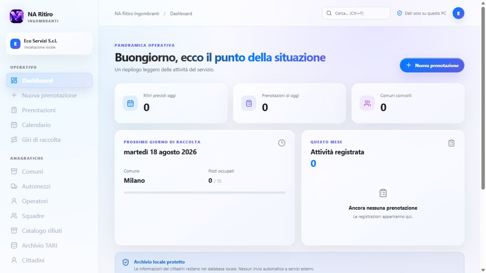

## 4. Dashboard

La Dashboard è il punto di controllo giornaliero. Mostra:

1. **Ritiri previsti oggi.**
2. **Prenotazioni di oggi.**
3. **Comuni coinvolti.**
4. Il prossimo giorno di raccolta e la capacità occupata.
5. Il riepilogo delle prenotazioni del mese.
6. Il richiamo alla protezione dell’archivio locale.

Per creare subito una richiesta premere **Nuova prenotazione** nell’intestazione.

## 5. Nuova prenotazione

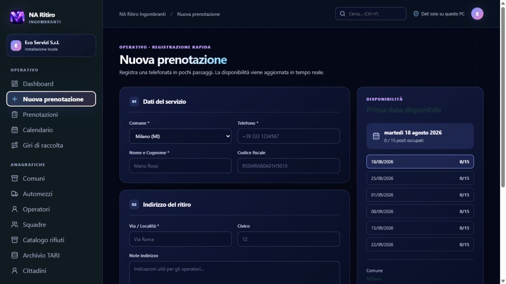

### 5.1 Compilare la richiesta

1. Selezionare il **Comune**.
2. Scegliere una data tra quelle disponibili.
3. Inserire il telefono del cittadino.
4. Inserire nome e cognome.
5. Inserire, se disponibile, il codice fiscale.
6. Inserire indirizzo e numero civico.
7. Aggiungere eventuali note sull’indirizzo.

### 5.2 Inserire i rifiuti

Per ogni riga:

1. scegliere la tipologia dal Catalogo rifiuti;
2. verificare la dimensione indicata;
3. inserire la quantità;
4. aggiungere una nota opzionale.

Usare **Aggiungi rifiuto** per inserire altre righe. Il riepilogo laterale mostra il totale dei pezzi e il limite del Comune.

### 5.3 Controlli automatici

Durante la compilazione l’app può mostrare:

- disponibilità della data;
- superamento del limite pezzi;
- possibili duplicati per telefono, codice fiscale o indirizzo;
- corrispondenza con l’archivio TARI.

Leggere sempre l’avviso prima di salvare. Se viene autorizzata un’eccezione, compilare il motivo richiesto.

### 5.4 Salvare

Premere **Salva prenotazione**. In caso di successo compare il codice leggibile della richiesta. Da quel momento la prenotazione è disponibile in Prenotazioni, Calendario, Report e Cittadini.

## 6. Prenotazioni

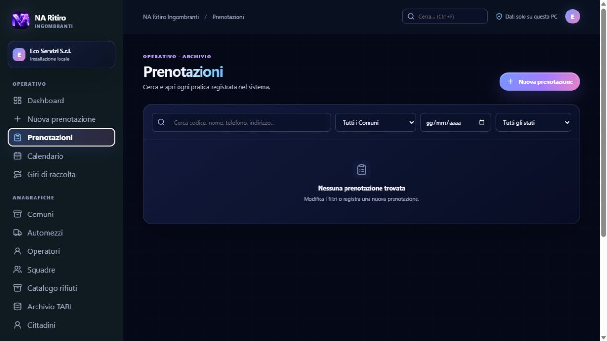

La pagina mostra l’elenco delle richieste registrate. Usare:

- ricerca testuale;
- filtro Comune;
- filtro data;
- filtro stato.

Fare clic su una riga per aprire il dettaglio laterale.

### 6.1 Stati della prenotazione

| Stato | Significato operativo |
|---|---|
| `PRENOTATA` | richiesta registrata, non ancora pianificata |
| `PIANIFICATA` | assegnata a un giro |
| `IN_CORSO` | attività in corso |
| `RITIRATA` | ritiro completato |
| `NON_ESPOSTO` | materiale non esposto |
| `UTENTE_ASSENTE` | cittadino assente o non reperibile |
| `NON_CONFORME` | materiale non conforme alle regole |
| `RITIRO_PARZIALE` | ritirata solo una parte del materiale |
| `ANNULLATA` | richiesta annullata |

Per `NON_CONFORME`, `RITIRO_PARZIALE` e `ANNULLATA` è obbligatoria una nota.

### 6.2 Dettaglio e storico

Nel dettaglio è possibile:

1. leggere dati del cittadino e dell’indirizzo;
2. vedere i rifiuti richiesti;
3. cambiare lo stato;
4. aggiungere una nota;
5. spostare la prenotazione a un’altra data;
6. consultare la cronologia dei cambi di stato.

## 7. Calendario

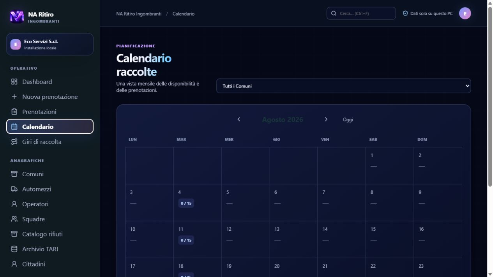

Il Calendario aiuta a controllare la capacità giornaliera.

1. Usare le frecce per cambiare mese.
2. Premere **Oggi** per tornare al mese corrente.
3. Fare clic sul giorno desiderato.
4. Leggere il numero di prenotazioni e la capacità disponibile.
5. Selezionare una prenotazione per aprire il dettaglio.

La barra o il colore di occupazione evidenzia le giornate prossime al limite.

## 8. Giri di raccolta

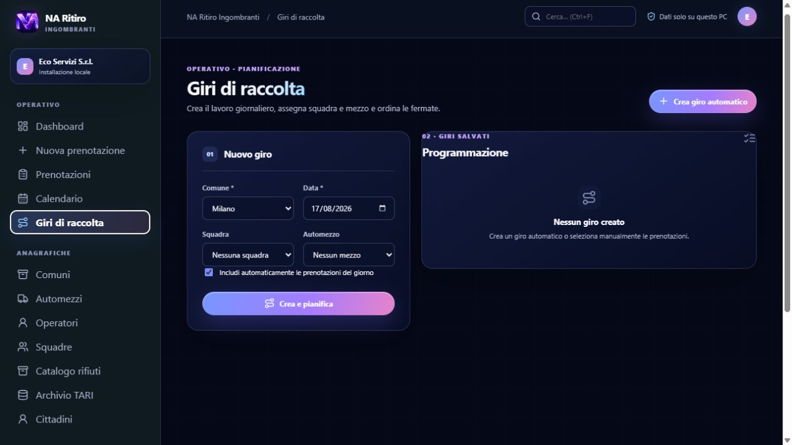

### 8.1 Creare un giro automatico

1. Aprire **Giri di raccolta**.
2. Selezionare Comune e data.
3. Selezionare, se disponibili, squadra e automezzo.
4. Lasciare attiva la modalità automatica.
5. Premere **Crea giro**.

L’app seleziona le prenotazioni compatibili della giornata e crea le fermate.

### 8.2 Creare un giro manuale

1. Selezionare Comune, data, squadra e automezzo.
2. Disattivare la modalità automatica.
3. Selezionare manualmente le prenotazioni da includere.
4. Premere **Crea giro**.

### 8.3 Riordinare e stampare

Nel dettaglio del giro:

- usare i comandi su/giù per cambiare l’ordine delle fermate;
- controllare indirizzo, cittadino e stato;
- usare **Stampa giro** per creare una stampa operativa.

La pianificazione porta le prenotazioni incluse allo stato `PIANIFICATA`.

### 8.4 Esportare il PDF operativo giornaliero

1. Selezionare Comune e data del servizio.
2. Premere **Esporta PDF operativo del giorno**. Se esiste un giro salvato per quella giornata, viene rispettato l'ordine delle fermate.
3. Nel PDF controllare automezzo, squadra, prenotazioni, tipologie, quantita e caselle per l'esito del ritiro.
4. Nell'app desktop scegliere il percorso nella finestra **Salva PDF operativo giornaliero**. Il nome proposto segue il formato `Ritiro_Ingombranti_Comune_YYYY-MM-DD.pdf`.

Il documento e in formato A4 orizzontale, puo avere piu pagine e riporta riepilogo, note servizio e spazio per la firma della squadra. Se non ci sono prenotazioni per Comune e data selezionati, l'app mostra un avviso e non crea un PDF vuoto.

## 9. Anagrafiche

### 9.1 Comuni

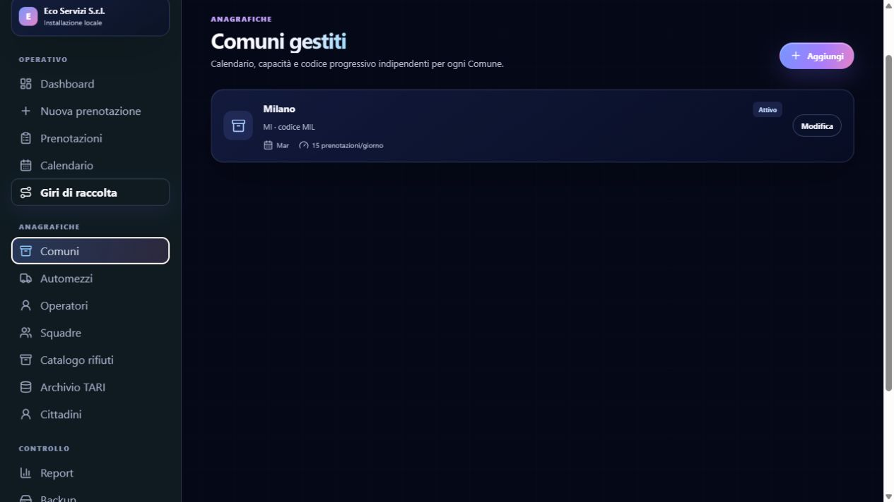

Gestire i Comuni serviti, il codice breve, i limiti giornalieri, i limiti pezzi e i giorni di raccolta. Modificare il Comune quando cambiano calendario o capacità.

### 9.2 Automezzi

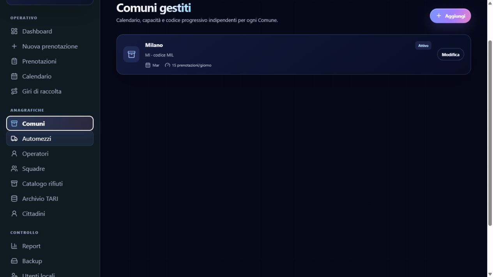

Registrare targa, descrizione, capacità e stato dell’automezzo. Un mezzo disattivato non deve essere usato per nuovi giri.

### 9.3 Operatori

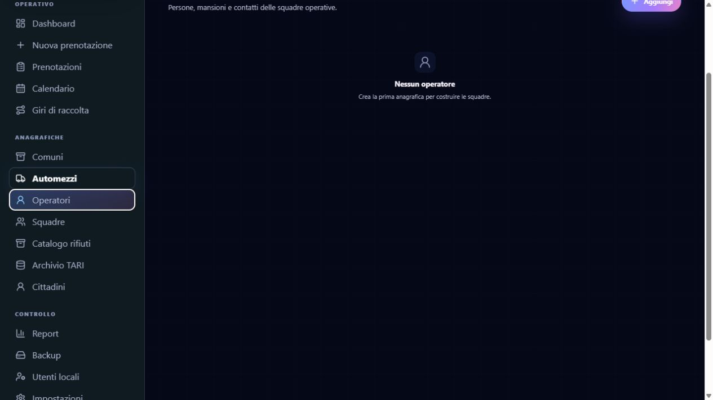

Inserire nome, ruolo e contatti degli operatori. Disattivare una scheda quando la persona non lavora più sul servizio, mantenendo lo storico.

### 9.4 Squadre

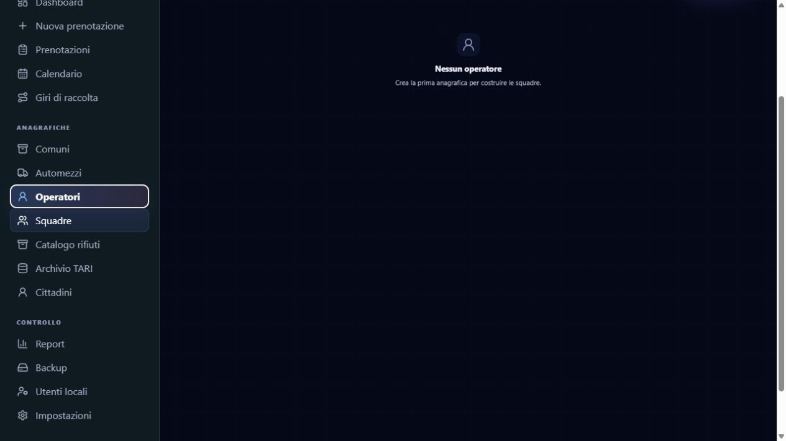

Creare una squadra, associare gli operatori e, quando previsto, il mezzo di riferimento. Le squadre sono utilizzabili nella pianificazione dei giri.

### 9.5 Catalogo rifiuti

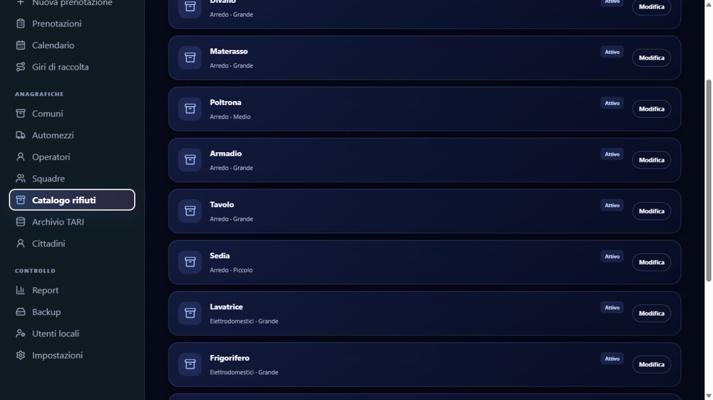

Per ogni tipologia definire nome, dimensione e stato attivo. Il catalogo alimenta le righe della Nuova prenotazione e i controlli dei limiti.

## 10. Archivio TARI

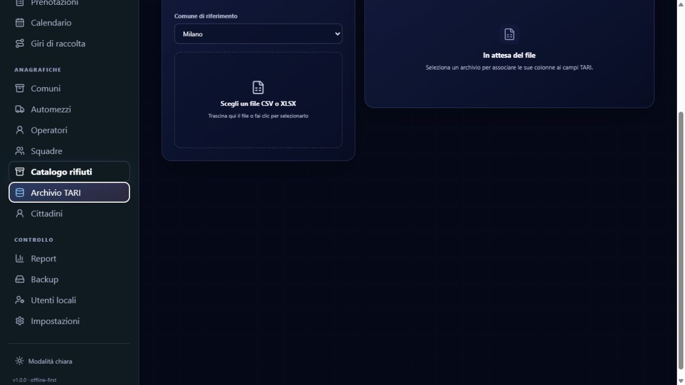

L’archivio TARI è separato per Comune.

### 10.1 Importare un file

1. Selezionare il Comune.
2. Scegliere un file CSV, XLSX o XLS.
3. Controllare il numero di righe lette.
4. Verificare la mappatura suggerita.
5. Associare le colonne a nome, codice fiscale, indirizzo, civico e codice utenza.
6. Controllare l’anteprima.
7. Premere **Importa archivio TARI**.

Il risultato distingue righe valide, problematiche, duplicate e totale righe. Non importare un file se le colonne sono mappate in modo errato.

### 10.2 Uso durante una prenotazione

Quando si compilano nome, codice fiscale o indirizzo, l’app ricerca possibili corrispondenze TARI. Usare il risultato come controllo, senza sostituire la verifica dell’operatore.

## 11. Cittadini e storico

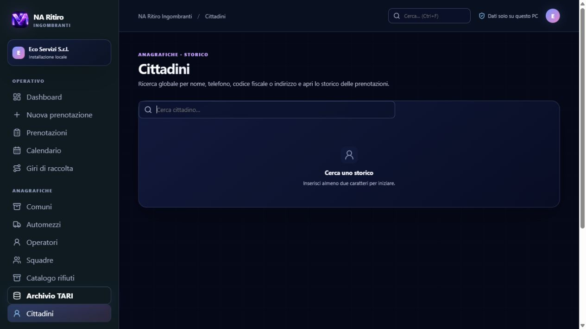

1. Aprire **Cittadini**.
2. Cercare per nome, telefono, codice fiscale o indirizzo.
3. Selezionare il cittadino o la prenotazione trovata.
4. Consultare dati, esiti e cronologia.

La ricerca è locale e non invia dati a servizi esterni.

## 12. Report ed esportazioni

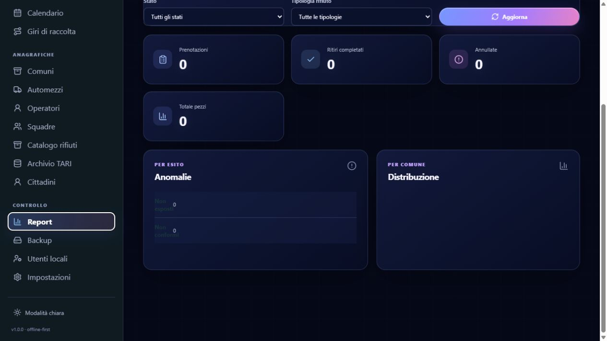

### 12.1 Filtrare il report

Impostare uno o più filtri:

- Comune;
- data iniziale;
- data finale;
- stato;
- tipologia di rifiuto.

Premere **Aggiorna** per ricalcolare i dati.

### 12.2 Esportare

- **CSV:** utile per Excel, controlli e importazioni.
- **XLSX:** crea un file Excel con il foglio Report.
- **PDF / stampa:** apre la stampa di sistema, da cui scegliere PDF o stampante.

Per un report ufficiale controllare sempre filtri e intervallo date prima dell’esportazione.

## 13. Backup e ripristino

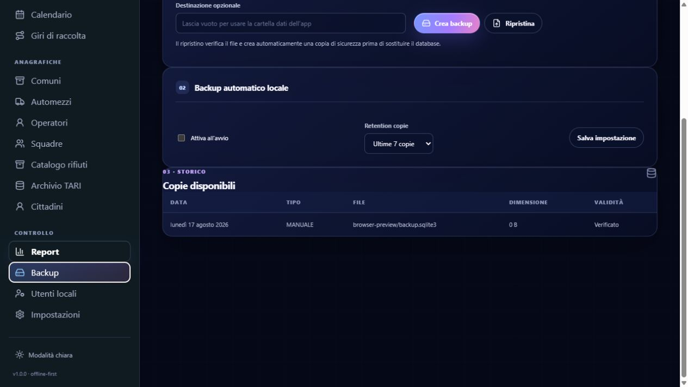

### 13.1 Backup manuale

1. Aprire **Backup**.
2. Lasciare vuoto **Destinazione opzionale** per usare la cartella dati dell’app.
3. In alternativa, inserire un percorso completo, ad esempio `D:\Backup\na-ritiro`.
4. Premere **Crea backup**.
5. Controllare la copia nello storico.

Il backup contiene il database locale dell’installazione.

### 13.2 Backup automatico

1. Attivare **Backup automatico locale**.
2. Scegliere ultime 7 o ultime 30 copie.
3. Premere **Salva impostazione**.

Nella versione 1.0.0 il backup automatico viene eseguito all’avvio dell’app desktop quando l’opzione è attiva.

### 13.3 Ripristino

1. Inserire nel campo il percorso completo del file `.db` o della copia disponibile.
2. Premere **Ripristina**.
3. Confermare l’operazione.
4. Attendere la verifica del file.
5. Riavviare l’applicazione per ricaricare i dati.

Prima di sostituire il database l’app crea una copia di sicurezza dello stato corrente. Non spegnere il computer durante il ripristino.

## 14. Utenti locali e sicurezza

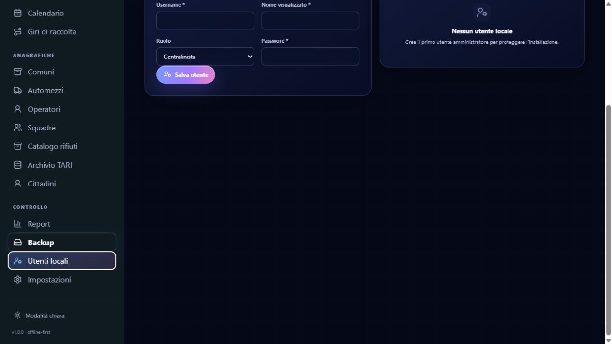

### 14.1 Creare un utente

1. Aprire **Utenti locali**.
2. Inserire username.
3. Inserire nome visualizzato.
4. Selezionare il ruolo.
5. Inserire una password.
6. Premere **Salva utente**.

Le password non vengono salvate in chiaro: il database conserva un hash con sale.

### 14.2 Ruoli disponibili

- **Amministratore:** configurazione e controllo dell’installazione.
- **Centralinista:** inserimento e gestione delle richieste.
- **Operatore:** attività operative, giri ed esiti.
- **Visualizzatore:** consultazione e report.

Creare almeno un amministratore e non condividere la password. La schermata ruoli è predisposta nella versione 1.0.0; l’accesso obbligatorio a ogni avvio e la matrice completa dei permessi possono essere estesi in una versione successiva.

## 15. Impostazioni

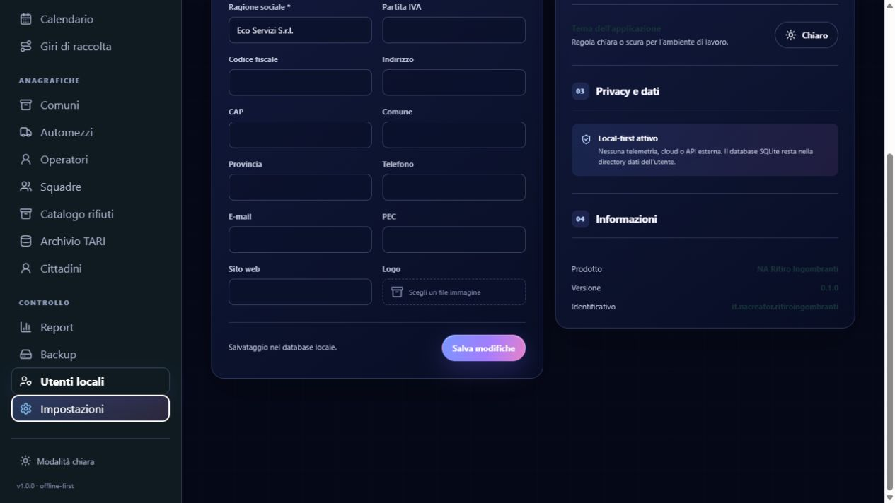

In **Impostazioni** controllare i dati dell’azienda, la modalità grafica e le informazioni dell’installazione. Usare il tema chiaro o scuro in base alle condizioni di lavoro; il tema non modifica i dati.

## 16. Flusso di lavoro consigliato

Per una giornata operativa:

1. Avviare l’app e controllare la Dashboard.
2. Verificare il prossimo giorno di raccolta nel Calendario.
3. Inserire le nuove richieste da Nuova prenotazione.
4. Controllare duplicati e corrispondenze TARI.
5. Creare i Giri di raccolta.
6. Riordinare le fermate e stampare il giro.
7. Aggiornare gli stati durante il servizio.
8. Registrare sempre una nota per non conformità, ritiro parziale o annullamento.
9. A fine giornata controllare Report e anomalie.
10. Eseguire un backup manuale quando richiesto dalla procedura aziendale.

## 17. Scorciatoie e accessibilità

- `Ctrl + N` apre Nuova prenotazione.
- `Ctrl + F` porta il cursore sulla ricerca globale.
- `Invio` conferma la ricerca globale.
- I pulsanti principali sono raggiungibili da tastiera.
- I colori sono accompagnati da testo e stati espliciti.
- La stampa dei giri e dei report nasconde gli elementi di navigazione non necessari.

## 18. Risoluzione dei problemi

### Il pulsante Continua non funziona

Controllare:

- ragione sociale valorizzata;
- Comune con nome e provincia;
- almeno un giorno di raccolta selezionato;
- nessun messaggio rosso nella pagina.

### Non vedo date disponibili

Verificare che:

- il Comune abbia giorni di raccolta configurati;
- la data non sia un giorno escluso;
- il limite giornaliero non sia già pieno.

### Il backup non compare

Controllare di usare l’app desktop e non solo la preview browser. Verificare il percorso inserito e i permessi della cartella di destinazione.

### Il ripristino non completa l’operazione

Verificare che il file sia una copia SQLite valida e che l’applicazione non sia aperta da un’altra istanza. Dopo il ripristino riavviare l’app.

### Un report è vuoto

Rimuovere temporaneamente i filtri Comune, stato, tipologia e date, poi premere **Aggiorna**. Se non esistono prenotazioni, il report mostrerà naturalmente valori pari a zero.

### Il browser mostra dati demo o temporanei

La preview browser serve per verificare l’interfaccia e usa un archivio di anteprima. Per i dati persistenti, i backup e il database ufficiale usare l’installer desktop.

## 19. Dati, privacy e manutenzione

- I dati dei cittadini restano nel database locale.
- Non è previsto traffico automatico verso servizi esterni.
- L’archivio TARI deve essere trattato come dato riservato.
- Conservare i backup in una cartella protetta e con accesso limitato.
- Stabilire una politica aziendale di conservazione e cancellazione.
- Prima di aggiornamenti importanti eseguire sempre un backup.
- Dopo un ripristino controllare Dashboard, Prenotazioni, Calendario e Report.

Per dettagli tecnici consultare anche:

- `DATABASE.md` per migrazioni e tabelle;
- `BACKUP-RESTORE.md` per le procedure di backup;
- `PRIVACY-DATA-FLOW.md` per il flusso dei dati;
- `BUILD-WINDOWS.md` per build e distribuzione.

## 20. Archivio screenshot

Le schermate usate in questo manuale sono disponibili in `manuale-utente/screenshots/`:

| File | Sezione |
|---|---|
| `01-dashboard-dark.png` | Dashboard — modalità scura |
| `02-nuova-prenotazione.png` | Nuova prenotazione |
| `03-prenotazioni.png` | Prenotazioni |
| `04-calendario.png` | Calendario |
| `05-giri-di-raccolta.png` | Giri di raccolta |
| `06-comuni.png` | Comuni |
| `07-automezzi.png` | Automezzi |
| `08-operatori.png` | Operatori |
| `09-squadre.png` | Squadre |
| `10-catalogo-rifiuti.png` | Catalogo rifiuti |
| `11-archivio-tari.png` | Archivio TARI |
| `12-cittadini.png` | Cittadini |
| `13-report.png` | Report |
| `14-backup.png` | Backup |
| `15-utenti-locali.png` | Utenti locali |
| `16-impostazioni.png` | Impostazioni |
| `17-dashboard-light.png` | Dashboard — modalità chiara Apple glass |

Le immagini possono essere sostituite in futuro dopo una modifica importante dell’interfaccia, mantenendo gli stessi nomi per non rompere i collegamenti del manuale.
